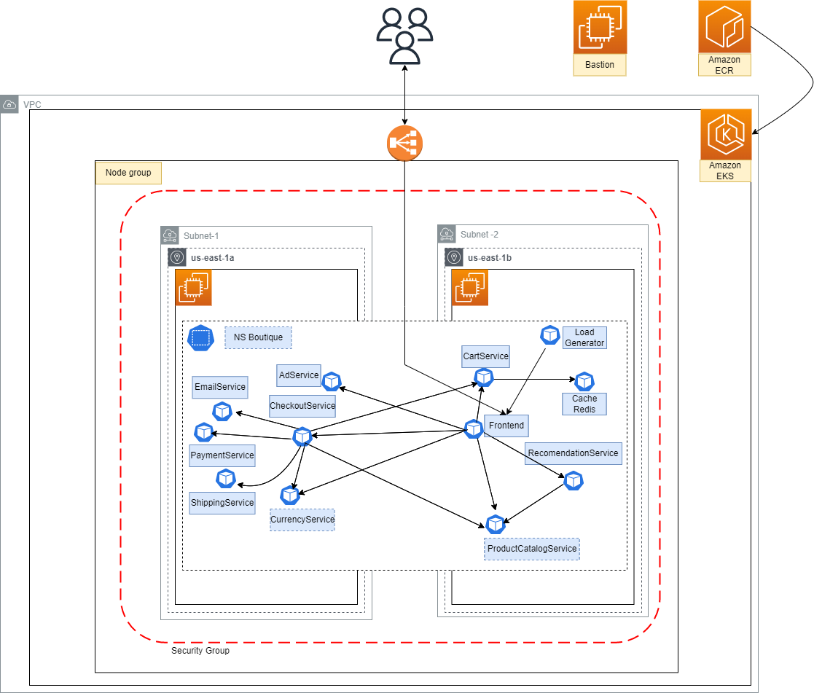

# OBLIGATORIO ISC

Online Boutique es una aplicación de demostración de microservicios nativa de la nube. Online Boutique consta de una aplicación de microservicios de 10 niveles. La aplicación es una aplicación de comercio electrónico basada en la web donde los usuarios pueden buscar artículos, agregarlos al carrito y comprarlos.

## Arquitectura

  
## DATOS DE LA INFRAESTRUCTURA

  * Tipo de instancias:
    * t3.large
    
  * CIDR VPC: 172.16.0.0/16
    * Subnet-1: 172.16.1.0/24
    * Subnet-2: 172.16.2.0/24
    
  * Security Group:
   
    * Reglas Permit de salida:
      * from_port = 0
      * to_port = 0
      * protocol = "-1"
      * cidr_blocks = ["0.0.0.0/0"] 
             
  * Zonas de disponibilidad:
    * us-east-1a
    * us-east-1b

## SERVICIOS DE AWS USADOS:
  * VPC
  * EKS (Elastic Kubernetes Service)
  * Instancia de EC2 (Utilizada como Bastion) 
  * ECR (Elastic Container Registry)

## Archivos de la implementación

### [Deployment_Infra](./deployment_infra)

  En esta carpeta encontraremos los archivos .tf necesarios para el deploy de la infra a implementar. Entre los que se encuentra la configuracion de la red, y el despligue de un Cluster EKS.

[variables.tf](./deployment_infra/variables.tf)

  * En este archivo almacenamos las variables que utilizaremos en la ejecucion terraform. La ventaja de usar variables en dicho archivo, es que en caso de que cambie algun dato, simplemente se cambiara el valor en dicho archivo, y no en todos los archivos que utilizen ese valor.

[provider.tf](./deployment_infra/provider.tf)

  * Se define el provider, en nuestro caso aws con la region a utilizar.

[red.tf](./deployment_infra/red.tf)

  * Definimos todos los servicios a utilizar en nuestra red, declarando primero nuestro vpc con su correspondiente CIDR.

  * Utilizamos el recurso vpc previamente creado, referenciandolo en los restantes recursos a crear de la siguiente forma:

    * aws_vpc.vpc-obligatorio.id

   * Se utilizaron las variables previamente mencionadas, referenciandolas de la siguiente forma:

      * var.nombre_asignado

[eks.tf](./deployment_infra/eks.tf)

  * En este archivo se encuentra el deployment de nuestro cluster, en conjunto con los workers que lo conforman.
  Al igual que en el archivo de red.tf, se utilizan variables mediante el llamado de las mismas con var.nombre_asignado y la referencia de recursos       previamente creados.
  
### [Deployment_Servicios](./deployment_servicios)

  En esta carpeta se encontraran los archivos de deployment correspondientes a cada servicio de la solucion.

[variables.tf](./deployment_servicios/variables.tf)

  * Utilizamos variables para las imagenes creadas en ECR, que luego seran utilizadas en cada deployment.

  * Existe un archivo .tf para cada servicio que requiere nuestra aplicacion web. Cada uno de ellos fue creado en formato terraform a partir de un archivo yaml.
  * En cada uno de estos archivos de deployment, la imagen esta como variable la cual es tomada de nuestro archivo de variables.

[config](./deployment_servicios/config)

  * Este archivo contiene la informacion de nuestro cluster EKS, previamente creado mediante el deploy de nuestra infra. El mismo es necesario para utilizar en el archivo de [provider.tf](./deployment_servicios/provider.tf).

### Deploy automatizado

[infra_deploy.sh](./infra_deploy.sh)

  * Script para realizar deploy de infra y microservicios que ejecuta los terraform correspondientes.
    * En una primera instancia se ejecuta un terraform que ejecutará el contenido de [Deployment_Infra](./deployment_infra).
    * Luego se actualizará el archivo [config](.//deployment_servicios/config) con la información del cluster creado previamente. Este archivo a su vez será utilizado en el [provider](./deployment_servicios/provider.tf) de la ejecución siguiente.
    * Por ultimo ejecuta el terraform con el contenido de [Deployment_Servicios](./deployment_servicios)
