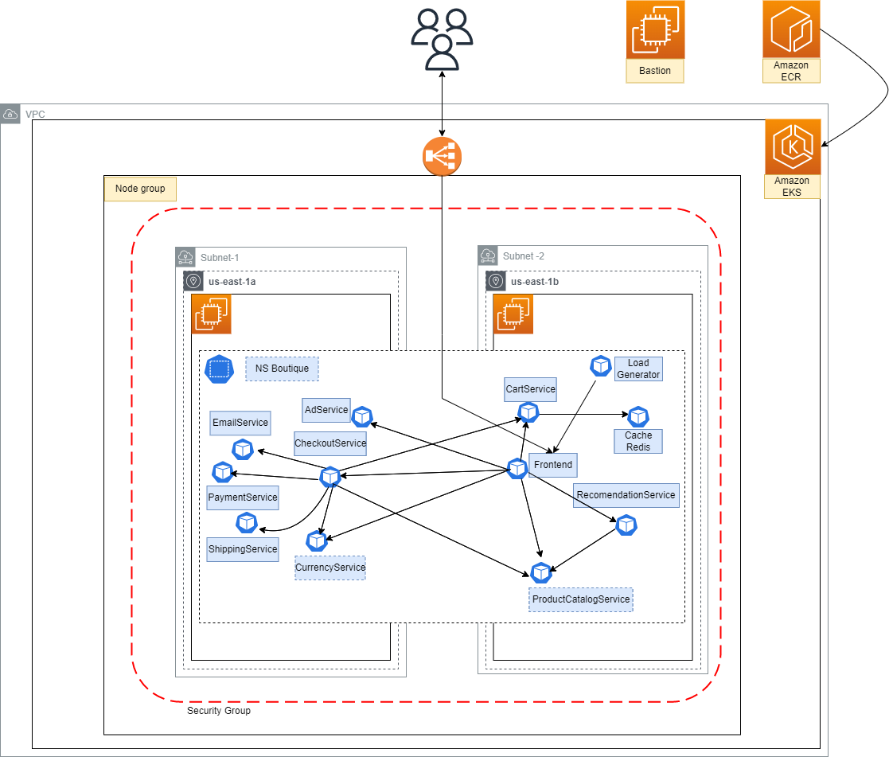
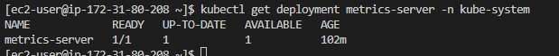
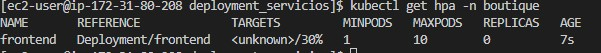

# OBLIGATORIO ISC


<p align="center">

</p>

Online Boutique es una aplicación de demostración de microservicios nativa de la nube. Online Boutique consta de una aplicación de microservicios de 10 niveles. La aplicación es una aplicación de comercio electrónico basada en la web donde los usuarios pueden buscar artículos, agregarlos al carrito y comprarlos.

<p align="center">

</p>

**Índice**

1. [Prerrequisitos](#id1)
2. [Comandos utiles](#id2)
3. [Arquitectura](#id3)
4. [Datos de la Infraestructura](#id4)
5. [Servicios de AWS usados](#id5)
6. [Archivos de la implementación](#id6)<br>
   6.1 [Deployment_Infra](#id7)<br>
   6.2 [Deployment_Servicios](#id8)<br>
7. [Deploy automatizado](#id9)
8. [Autoscaler](#id10)

## Prerrequisitos<a name="id1"></a>

Al tratarse de un ambiente educate, antes de ejecutar el [infra_deploy.sh](./infra_deploy.sh), se debe actualizar el archivo credentials tanto del usuario ec2-user como de root, en el servidor bastion.

En este caso utilizaremos un bastion, que ya cuenta con lo necesario para la ejecucion satisfactoria del scritp. En caso de querer ejecutarlo en otra instacia o equipo, se debera:

- Instalar terraform.
- Instalar docker.
- Realizar la aws configure y actualizar el archivo credentials.
- Instalar cliente kubectl.

### Comandos utiles<a name="id2"></a>

kubectl get all -n boutique

kubectl get hpa -n boutique


## Arquitectura<a name="id3"></a>

<p align="center">

</p>

  
## DATOS DE LA INFRAESTRUCTURA<a name="id4"></a>

  * Tipo de instancias:
    * t3.large
    
  * CIDR VPC: 172.16.0.0/16
    * Subnet-1: 172.16.1.0/24
    * Subnet-2: 172.16.2.0/24
    
  * Security Group:
   
    * Reglas Permit de salida:
      * from_port = 0
      * to_port = 0
      * protocol = "-1"
      * cidr_blocks = ["0.0.0.0/0"] 
             
  * Zonas de disponibilidad:
    * us-east-1a
    * us-east-1b

## SERVICIOS DE AWS USADOS<a name="id1"></a>
  * VPC
  * EKS (Elastic Kubernetes Service)
  * Instancia de EC2 (Utilizada como Bastion) 
  * ECR (Elastic Container Registry)


## Archivos de la implementación<a name="id6"></a>

### [Deployment_Infra](./deployment_infra)<a name="id7"></a>

  En esta carpeta encontraremos los archivos .tf necesarios para el deploy de la infra a implementar. Entre los que se encuentra la configuracion de la red, y el despligue de un Cluster EKS.


[variables.tf](./deployment_infra/variables.tf)

  * En este archivo almacenamos las variables que utilizaremos en la ejecucion terraform. La ventaja de usar variables en dicho archivo, es que en caso de que cambie algun dato, simplemente se cambiara el valor en dicho archivo, y no en todos los archivos que utilizen ese valor.

[provider.tf](./deployment_infra/provider.tf)

  * Se define el provider, en nuestro caso aws con la region a utilizar.

[red.tf](./deployment_infra/red.tf)

  * Definimos todos los servicios a utilizar en nuestra red, declarando primero nuestro vpc con su correspondiente CIDR.

  * Utilizamos el recurso vpc previamente creado, referenciandolo en los restantes recursos a crear de la siguiente forma:
      ```
      aws_vpc.vpc-obligatorio.id
      ```

   * Se utilizaron las variables previamente mencionadas, referenciandolas de la siguiente forma:
      ```
      var.nombre_asignado
      ```


[eks.tf](./deployment_infra/eks.tf)

  * En este archivo se encuentra el deployment de nuestro cluster, en conjunto con los workers que lo conforman.
  Al igual que en el archivo de red.tf, se utilizan variables mediante el llamado de las mismas con var.nombre_asignado y la referencia de recursos previamente creados.
  
[ecr.tf](./deployment_infra/ecr.tf)
   
   * En este archivo se encuentra la creación de los repositorios necesarios para el posterior deploy de nuestros servicios. A su vez, luego de creados dichos repositorios obtendremos para cada uno de ellos mediante el recurso "output" el valor de su URL. 
Para ello se implemento de la siguiente forma:

```
output "nombre_variable" {
  value       = aws_ecr_repository.nombre_repositorio.repository_url
  }
``` 
  Valor que se tomara como variable y utilizado luego en el [infra_deploy.sh](./infra_deploy.sh) para el push de imágenes hacia ECR.

  
### [Deployment_Servicios](./deployment_servicios)<a name="id8"></a>

  En esta carpeta se encontraran los archivos de deployment correspondientes a cada servicio de la solucion.

[variables.tf](./deployment_servicios/variables.tf)

  * Utilizamos variables para las imagenes creadas en ECR, que luego seran utilizadas en cada deployment.
  * Existe un archivo .tf para cada servicio que requiere nuestra aplicacion web. Cada uno de ellos fue creado en formato terraform a partir de un archivo yaml.
  * En cada uno de estos archivos de deployment, la imagen esta como variable la cual es tomada de nuestro archivo de variables.

[config](./deployment_servicios/config)

  * Este archivo contiene la informacion de nuestro cluster EKS, previamente creado mediante el deploy de nuestra infra. El mismo es necesario para utilizar en el archivo de [provider.tf](./deployment_servicios/provider.tf).

### Deploy automatizado<a name="id9"></a>

[infra_deploy.sh](./infra_deploy.sh)

  * Script para realizar deploy de infra y microservicios que ejecuta los terraform correspondientes.
    
    * En una primera instancia se ejecuta un terraform que ejecutará el contenido de [Deployment_Infra](./deployment_infra).
    * Luego se actualizará el archivo [config](.//deployment_servicios/config) con la información del cluster creado previamente. Este archivo a su vez será utilizado en el [provider](./deployment_servicios/provider.tf) de la ejecución siguiente.
    * Luego se subiran las imágenes previamente buildeadas manualmente en el bastion hacia ECR, para llevar esto a cabo se crean variables dentro del script con la      salida arrojada por el archivo [ecr.tf](./deployment_infra/ecr.tf) de la siguiente forma:
     ``` 
    nombre_variable=$(terraform output -raw nombre_variable_output)
    ``` 
      Estas variables son utilizadas para renombrar las imagenes locales, y poder realizar el push hacia ECR.
   * Por ultimo ejecuta el terraform con el contenido de [Deployment_Servicios](./deployment_servicios), el cual despliega los servicios tomando como repositorios los       creados en ECR.


## Autoscaler<a name="id10"></a>

Se implemento un Horizontal Pod Autoscaler, para poder escalar pods basado en el consumo de CPU. A modo de ejemplo se realizo un HPA en el pod del fronted.
El cual mediante pruebas de carga se podra verificar el funcionamiento.

En primera instancia se tuvo que instalar un Metrics Server, para poder medir el consumo de dichos recursos.  Y luego se creo el autoscale sobre el deployment deseado

<p align="center">

</p>

kubectl autoscale deployment fronted -n boutique --cpu-percent=50 --min=1 --max=10

Estableciendo la cantidad de CPU, que llegado a dicho limite se genere una nueva instancia de dicho pod.

Verificamos la creacion del HPA.
<p align="center">

</p>


__Autores__ :muscle:

> Lucía Castiñeiras :octocat:

> Sebastián Feijó :floppy_disk:

> Damián Álvarez :computer:

